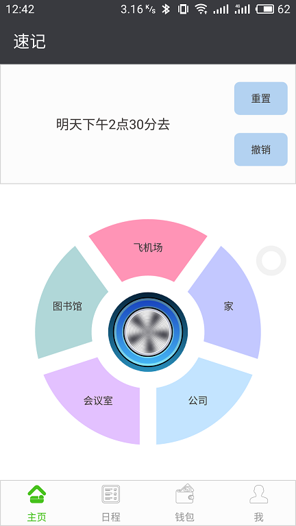
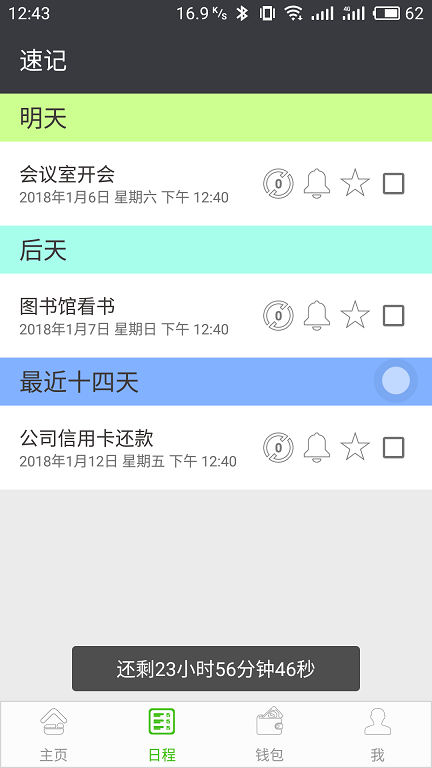
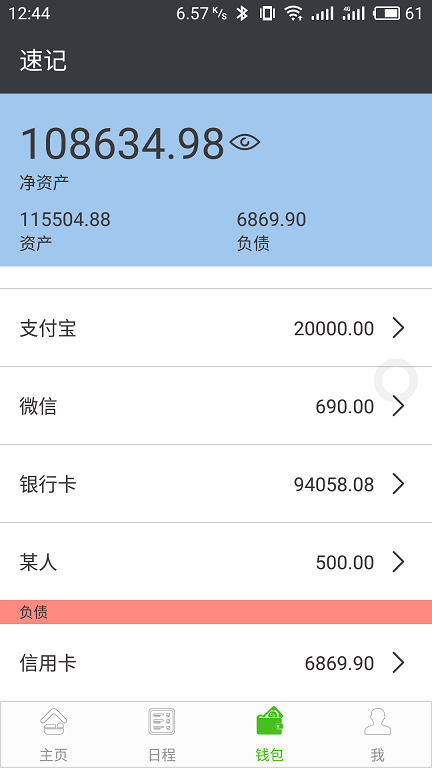
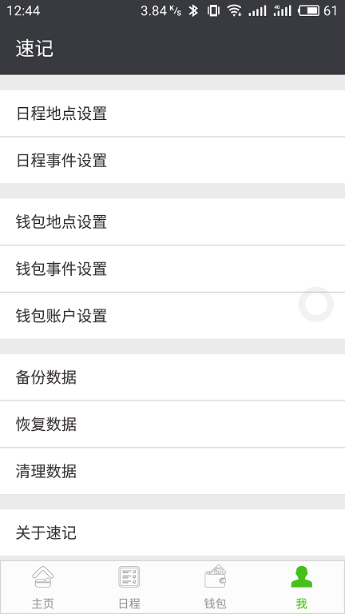
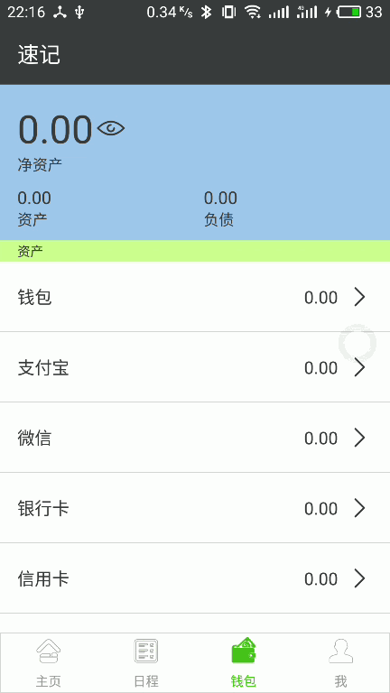
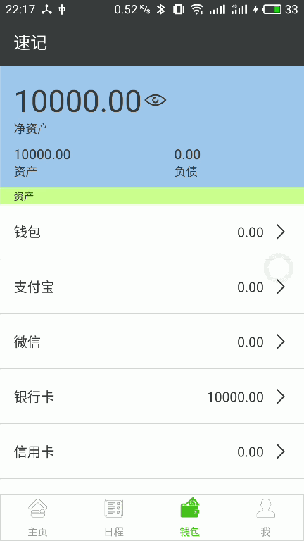
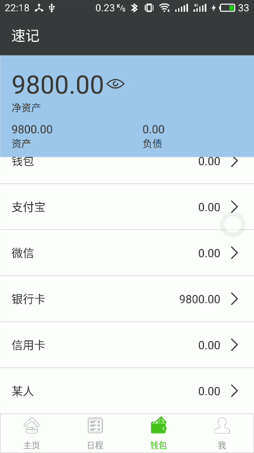

# 一款简单、轻量、高效的Android记事、记账应用

## 目录
1. [亮点](#亮点)
2. [概览](#概览)
3. [使用方式](#使用方式)
4. [下载](#下载)
5. [版本更新](#版本更新)
6. [最后](#最后)

## 亮点：
1. 个人开发者开发，[Lite版本](./apk/QuickNotesLite.apk)不需要任何Android权限，[Premium版本](./apk/QuickNotesPremium.apk)需要设置闹钟权限（事件提醒）以及存储卡权限（备份和恢复数据）。
2. 无启动页、无广告。
3. 单一进程，无任何后台驻留服务，不接收任何广播自动唤醒，用完即走。
4. 后台采用Android系统SQLite数据库存储，前台界面参考微信的设计，一目了然。
5. 应用轻量，安装包仅仅1.34MB大小
6. 启动速度快，冷启动仅0.6秒（测试机型魅族Note6，Flyme 6.1.4.5A）。
7. 内存占用小，仅仅为2个 HelloWorld 项目的内存占用（测试机型魅族Note6，Flyme 6.1.4.5A）。
8. 代码可靠，每一行都精心Review。
9. 不发送任何通知和提醒，仅仅借助系统闹钟实现提醒。
10. 根据系统语言自动切换中文或者 English。

## 概览
1. 轻击记录  

2. 胸有成竹  

3. 一目了然  

4. 定制随心  

## 使用方式
1. 创建一个待做事项  

2. 创建一个收入事件  

3. 创建一个支出事件  

4. 创建一个转账事件  

## 下载
1. [Lite版本](./apk/QuickNotesLite.apk)，右键下载，无需任何 Android 权限。
2. [Premium版本](./apk/QuickNotesPremium.apk)，右键下载，需要设置闹钟、读写存储卡权限。
#### （两个版本可以覆盖安装）

## 版本更新
### Version 1.1 新增一个新功能，菜单栏新增《记录一个想法》
#### 因为，大多数时候，我们的想法仅仅是想法，不会立即提上日程，也不是循环事件，比如，我想学习一下新东西（但不是现在），我想选个时间去某地旅游（但不是现在），如果遵循《速记》的规则，只能新增选项然后记录，现在提供一个更简便的方式，直接记录一条未来事项，让心中的想法或灵感随时能够被记录下来！
### Version 1.0 大多数功能开发完毕

## 最后
#### 如果觉得《速记》帮助到了您，并希望支持《速记》的后续开发和维护，那么可以给我一个Star（Star一下又不会怀孕）！
#### 如果有任何问题或建议，请提交 Issues 或发邮件给 JarenChow@outlook.com，感谢！
